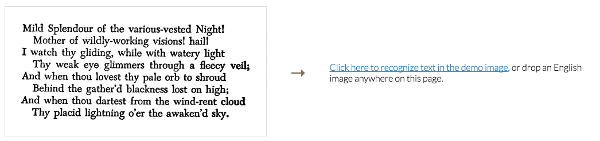

> # UNDER CONSTRUCTION
> Just working on Firefox support!

# [Tesseract.js](http://tesseract.projectnaptha.com/)

Tesseract.js is a javascript library that gets words in [almost any language](./tesseract_lang_list.md) out of images. ([Demo](http://tesseract.projectnaptha.com/))

<!-- Under the hood, Tesseract.js wraps [tesseract.js-core](https://github.com/naptha/tesseract.js-core), an [emscripten](https://github.com/kripken/emscripten) port of the [Tesseract OCR Engine](https://github.com/tesseract-ocr/tesseract).
 -->

[](http://tesseract.projectnaptha.com)

Tesseract.js works with script tags, webpack/browserify, and node. [After you install it](#installation), using it is as simple as 
```javascript
Tesseract.recognize(my_image)
         .progress(function  (p) { console.log('progress', p)    })
         .then(function (result) { console.log('result', result) })
```

[Check out the docs](#docs) for a full treatment of the API.


# Installation
Tesseract.js works with a `<script>` tag via local copy or cdn, with webpack and browserify via `npm`, and on node via `npm`. [Check out the docs](#docs) for a full treatment of the API.

## &lt;script/>

You can either include Tesseract.js on you page with a cdn like this:
```html
<script src='https://cdn.rawgit.com/naptha/tesseract.js/0.2.0/dist/tesseract.js'></script>
```

Or you can grab copies of `tesseract.js` and `worker.js` from the [dist folder](https://github.com/naptha/tesseract.js/tree/master/dist) and include your local copies like this:
```html
<script src='/path/to/tesseract.js'></script>
<script>
var LocalTesseract = Tesseract.create({
    workerPath: '/path/to/worker.js',
    langPath: 'https://cdn.rawgit.com/naptha/tessdata/gh-pages/3.02/',
    tesseractPath: 'https://cdn.rawgit.com/naptha/tesseract.js-core/0.1.0/index.js',
})
// from now on use LocalTesseract instead of Tesseract
</script>
```

After including your scripts, the `Tesseract` variable should be defined! You can [head to the docs](#docs) for a full treatment of the API.

## npm
First:
```shell
> npm install tesseract.js --save
```

Then
```javascript
var Tesseract = require('tesseract.js')
```

or
```javascript
import Tesseract from 'tesseract.js'
```

You can [head to the docs](#docs) for a full treatment of the API.

# Docs 

* [Tesseract.recognize(image: ImageLike[, options]) -> [TesseractJob](#tesseractjob)](#tesseractrecognizeimage-imagelike-options---tesseractjob)
  + [Simple Example](#simple-example)
  + [More Complicated Example](#more-complicated-example)
* [Tesseract.detect(image: ImageLike) -> [TesseractJob](#tesseractjob)](#tesseractdetectimage-imagelike---tesseractjob)
* [ImageLike](#imagelike)
* [TesseractJob](#tesseractjob)
  + [TesseractJob.progress(callback: function) -> TesseractJob](#tesseractjobprogresscallback-function---tesseractjob)
  + [TesseractJob.then(callback: function) -> TesseractJob](#tesseractjobthencallback-function---tesseractjob)
  + [TesseractJob.catch(callback: function) -> TesseractJob](#tesseractjoberrorcallback-function---tesseractjob)
* [Tesseract Remote File Options](#tesseract-remote-file-options)
  + [Tesseract.coreUrl](#tesseractcoreurl)
  + [Tesseract.workerUrl](#tesseractworkerurl)
  + [Tesseract.langUrl](#tesseractlangurl)
* [Contributing](#contributing)
  + [Development](#development) 
  + [Building Static Files](#building-static-files)
  + [Send us a Pull Request!](#send-us-a-pull-request)


## Tesseract.recognize(image: [ImageLike](#imagelike)[, options]) -> [TesseractJob](#tesseractjob)
Figures out what words are in `image`, where the words are in `image`, etc.
- `image` is any [ImageLike](#imagelike) object.
- `options` is either absent (in which case it is interpreted as `'eng'`), a string specifing a language short code from the [language list](./tesseract_lang_list.md), or a flat json object that may:
    + include properties that override some subset of the [default tesseract parameters](./tesseract_parameters.md)
    + include a `lang` property with a value from the [list of lang parameters](./tesseract_lang_list.md)

Returns a [TesseractJob](#tesseractjob) whose `then`, `progress`, and `catch` methods can be used to act on the result.

### Simple Example:
```javascript
Tesseract.recognize(document.querySelector('#my-image'))
.then(function(result){
    console.log(result)
})
```

### More Complicated Example:
```javascript
// if we know our image is of spanish words without the letter 'e':
Tesseract.recognize(document.querySelector('#my-image'), {
    lang: 'spa',
    tessedit_char_blacklist: 'e'
})
.then(function(result){
    console.log(result)
})
```


## Tesseract.detect(image: [ImageLike](#imagelike)) -> [TesseractJob](#tesseractjob)

Figures out what script (e.g. 'Latin', 'Chinese') the words in  image are written in.

- `image` is any [ImageLike](#imagelike) object.

Returns a [TesseractJob](#tesseractjob) whose `then`, `progress`, and `error` methods can be used to act on the result of the script.


```javascript
Tesseract.detect(document.querySelector('#my-image'))
.then(function(result){
    console.log(result)
})
```


## ImageLike

The main Tesseract.js functions take an `image` parameter, which should be something that is like an image. What's considered "image-like" differs depending on whether it is being run from the browser or through NodeJS.


On a browser, an image can be:
- an `img`, `video`, or `canvas` element
- a CanvasRenderingContext2D (returned by `canvas.getContext('2d')`)
- a `File` object (from a file `<input>` or drag-drop event)
- a `Blob` object
- a `ImageData` instance (an object containing `width`, `height` and `data` properties)
- a path or URL to an accessible image (the image must either be hosted locally or accessible by CORS)


In NodeJS, an image can be
- a path to a local image
- a `Buffer` instance containing a `PNG` or `JPEG` image
- a `ImageData` instance (an object containing `width`, `height` and `data` properties)


## TesseractJob
A TesseractJob is an an object returned by a call to recognize or detect.
All methods of a given TesseractJob return that TesseractJob to enable chaining. 

Typical use is: 
```javascript
Tesseract.recognize(document.querySelector('#my-image'))
    .progress(function(message){console.log(message)})
    .catch(function(err){console.error(err)})
    .then(function(result){console.log(result)})
```

Which is equivalent to:
```javascript
var job1 = Tesseract.recognize(document.querySelector('#my-image'));

job1.progress(function(message){console.log(message)});

job1.catch(function(err){console.error(err)});

job1.then(function(result){console.log(result)})
```


### TesseractJob.progress(callback: function) -> TesseractJob
Sets `callback` as the function that will be called every time the job progresses. 
- `callback` is a function with the signature `callback(progress)` where `progress` is a json object.

For example: 
```javascript
Tesseract.recognize(document.querySelector('#my-image'))
    .progress(function(message){console.log('progress is: 'message)})
```

The console will show something like: 
```javascript
progress is: {loaded_lang_model: "eng", from_cache: true}
progress is: {initialized_with_lang: "eng"}
progress is: {set_variable: Object}
progress is: {set_variable: Object}
progress is: {recognized: 0}
progress is: {recognized: 0.3}
progress is: {recognized: 0.6}
progress is: {recognized: 0.9}
progress is: {recognized: 1}
```


### TesseractJob.then(callback: function) -> TesseractJob
Sets `callback` as the function that will be called if and when the job successfully completes. 
- `callback` is a function with the signature `callback(result)` where `result` is a json object.


For example: 
```javascript
Tesseract.recognize(document.querySelector('#my-image'))
    .then(function(result){console.log('result is: 'result)})
```

The console will show something like: 
```javascript
progress is: {
    blocks: Array[1]
    confidence: 87
    html: "<div class='ocr_page' id='page_1' ..."
    lines: Array[3]
    oem: "DEFAULT"
    paragraphs: Array[1]
    psm: "SINGLE_BLOCK"
    symbols: Array[33]
    text: "Hello World↵from beyond↵the Cosmic Void↵↵"
    version: "3.04.00"
    words: Array[7]
}
```

### TesseractJob.catch(callback: function) -> TesseractJob
Sets `callback` as the function that will be called if the job fails. 
- `callback` is a function with the signature `callback(erros)` where `error` is a json object.

## Tesseract Remote File Options
### Tesseract.coreUrl
A string specifying the location of the [tesseract.js-core library](https://github.com/naptha/tesseract.js-core), with default value 'https://cdn.rawgit.com/naptha/tesseract.js-core/master/index.js'. Set this string before calling `Tesseract.recognize` and `Tesseract.detect` if you want Tesseract.js to use a different file.

For example:
```javascript
Tesseract.coreUrl = 'https://absolute-path-to/tesseract.js-core/index.js'
```

### Tesseract.workerUrl
A string specifying the location of the [tesseract.worker.js](./dist/tesseract.worker.js) file, with default value 'https://cdn.rawgit.com/naptha/tesseract.js/8b915dc/dist/tesseract.worker.js'. Set this string before calling `Tesseract.recognize` and `Tesseract.detect` if you want Tesseract.js to use a different file.

For example:
```javascript
Tesseract.workerUrl = 'https://absolute-path-to/tesseract.worker.js'
```


### Tesseract.langUrl
A string specifying the location of the tesseract language files, with default value 'https://cdn.rawgit.com/naptha/tessdata/gh-pages/3.02/'. Language file urls are calculated according to the formula `Tesseract.langUrl + lang + '.traineddata.gz'`. Set this string before calling `Tesseract.recognize` and `Tesseract.detect` if you want Tesseract.js to use different language files.

In the following exampple, Tesseract.js will download the language file from 'https://absolute-path-to/lang/folder/rus.traineddata.gz':
```javascript
Tesseract.langUrl = 'https://absolute-path-to/lang/folder/'

Tesseract.recognize('#my-im', {
    lang: 'rus'
})
```


## Contributing
### Development
To run a development copy of tesseract.js, first clone this repo.
```shell
> git clone https://github.com/naptha/tesseract.js.git
```

Then, cd in to the folder, `npm install`, and `npm start`
```shell
> cd tesseract.js
> npm install && npm start

  ... a bunch of npm stuff ... 

  Starting up http-server, serving ./
  Available on:
    http://127.0.0.1:7355
    http://[your ip]:7355

```

Then open `http://localhost:7355` in your favorite browser. The devServer automatically rebuilds tesseract.js and tesseract.worker.js when you change files in the src folder.

### Building Static Files
After you've cloned the repo and run `npm install` as described in the [Development Section](#development), you can build static library files in the dist folder with 
```shell
> npm run build
```

### Send us a Pull Request!
Thanks :)
