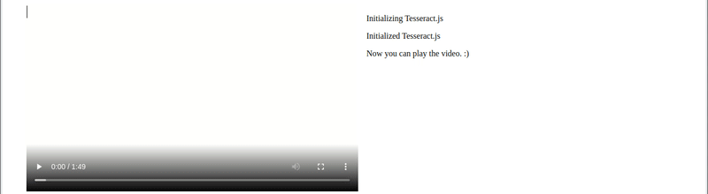

<p align="center">
  <a href="https://tesseract.projectnaptha.com/">
    <picture>
      <source media="(prefers-color-scheme: dark)" srcset="./docs/images/tesseract_dark.png">
      
    </picture>
  </a>
</p>


[](https://github.com/naptha/tesseract.js) 
[](https://opencollective.com/tesseractjs) [](https://badge.fury.io/js/tesseract.js)
[](https://github.com/naptha/tesseract.js/graphs/commit-activity)
[](https://opensource.org/licenses/Apache-2.0)
[](https://github.com/airbnb/javascript)


Tesseract.js is a javascript library that gets words in [almost any language](./docs/tesseract_lang_list.md) out of images. ([Demo](http://tesseract.projectnaptha.com/))

Image Recognition

[](http://tesseract.projectnaptha.com)

Video Real-time Recognition

<p align="center">
  <a href="https://github.com/jeromewu/tesseract.js-video"></a>
</p>

Tesseract.js works in the browser using [webpack](https://webpack.js.org/), esm, or plain script tags with a [CDN](#CDN) and on the server with [Node.js](https://nodejs.org/en/).
After you [install it](#installation), using it is as simple as:

```javascript
import { createWorker } from 'tesseract.js';

(async () => {
  const worker = await createWorker('eng');
  const ret = await worker.recognize('https://tesseract.projectnaptha.com/img/eng_bw.png');
  console.log(ret.data.text);
  await worker.terminate();
})();
```
When recognizing multiple images, users should create a worker once, run `worker.recognize` for each image, and then run `worker.terminate()` once at the end (rather than running the above snippet for every image). 

## Installation
Tesseract.js works with a `<script>` tag via local copy or CDN, with webpack via `npm` and on Node.js with `npm/yarn`.

### CDN
```html
<!-- v5 -->
<script src='https://cdn.jsdelivr.net/npm/tesseract.js@5/dist/tesseract.min.js'></script>
```
After including the script the `Tesseract` variable will be globally available and a worker can be created using `Tesseract.createWorker`.

Alternatively, an ESM build (used with `import` syntax) can be found at `https://cdn.jsdelivr.net/npm/tesseract.js@5/dist/tesseract.esm.min.js`. 

### Node.js

**Tesseract.js v7 requires Node.js v16 or newer.** (Tesseract.js v6 requires Node.js v14 or newer.)

```shell
# For latest version
npm install tesseract.js
yarn add tesseract.js

# For old versions
npm install tesseract.js@3.0.3
yarn add tesseract.js@3.0.3
```

## Project Scope
Tesseract.js aims to bring the [Tesseract](https://github.com/tesseract-ocr/tesseract) OCR engine (a separate project) to the browser and Node.js, and works by wrapping a [WebAssembly port](https://github.com/naptha/tesseract.js-core) of Tesseract.  This project does not modify core Tesseract features.  Most notably, **Tesseract.js does not support PDF files and does not modify the Tesseract recognition model to improve accuracy.**

If your project requires features outside of this scope, consider the [Scribe.js library](https://github.com/scribeocr/scribe.js).  Scribe.js is an alternative library created to accommodate common feature requests that are outside of the scope of this repo.  Scribe.js includes improvements to the Tesseract recognition model and supports extracting text from PDF documents, among other features.  For more information see [Scribe.js vs. Tesseract.js](https://github.com/scribeocr/scribe.js/blob/master/docs/scribe_vs_tesseract.md).

## Documentation

* [Workers vs. Schedulers](./docs/workers_vs_schedulers.md)
* [Examples](./docs/examples.md)
* [Supported Image Formats](./docs/image-format.md)
* [API](./docs/api.md)
* [Local Installation](./docs/local-installation.md)
* [FAQ](./docs/faq.md)

## Community Projects and Examples
The following are examples and projects built by the community using Tesseract.js. Officially supported examples are found in the [examples](https://github.com/naptha/tesseract.js/tree/master/examples) directory. 

- Projects
   - Scribe OCR: web application for scanning documents (images and PDFs)
      - Site at [scribeocr.com](https://scribeocr.com/), repo at [github.com/scribeocr/scribeocr](https://github.com/scribeocr/scribeocr)
   - Chrome Extension (with Manifest V3): https://github.com/Tshetrim/Image-To-Text-OCR-extension-for-ChatGPT
- Examples
   - Converting PDF to text: https://github.com/racosa/pdf2text-ocr
   - Use `blocks` output to generate granular data [word/symbol level]: https://github.com/Kishlay-notabot/tesseract-bbox-examples
   - Electron: https://github.com/Balearica/tesseract.js-electron
   - Typescript: https://github.com/Balearica/tesseract.js-typescript
 
If you have a project or example repo that uses Tesseract.js, feel free to add it to this list using a pull request. Examples submitted should be well documented such that new users can run them; projects should be functional and actively maintained.

## Major changes in v6
Version 6 changes are documented in [this issue](https://github.com/naptha/tesseract.js/issues/993).  Highlights are below.
 - Fixed memory leak in previous versions
 - Overall reductions in runtime and memory usage
 - Breaking changes:
    - All outputs formats other than `text` are disabled by default.
      - To re-enable the `hocr` output (for example), set the following: `worker.recognize(image, {}, { hocr: true })`
    - Minor changes to the structure of the JavaScript object (`blocks`) output
    - See [this issue](https://github.com/naptha/tesseract.js/issues/993) for full list

## Major changes in v5
Version 5 changes are documented in [this issue](https://github.com/naptha/tesseract.js/issues/820).  Highlights are below.

 - Significantly smaller files by default (54% smaller for English, 73% smaller for Chinese)
    - This results in a ~50% reduction in runtime for first-time users (who do not have the files cached yet)
 - Significantly lower memory usage
 - Breaking changes:
    - `createWorker` arguments changed
       - Setting non-default language and OEM now happens in `createWorker`
          - E.g. `createWorker("chi_sim", 1)`
    - `worker.initialize` and `worker.loadLanguage` functions should be deleted from code
    - See [this issue](https://github.com/naptha/tesseract.js/issues/820) for full list

Upgrading from v2 to v5?  See [this guide](https://github.com/naptha/tesseract.js/issues/771).

## Major changes in v4
Version 4 includes many new features and bug fixes--see [this issue](https://github.com/naptha/tesseract.js/issues/662) for a full list.  Several highlights are below. 

- Added rotation preprocessing options (including auto-rotate) for significantly better accuracy
- Processed images (rotated, grayscale, binary) can now be retrieved
- Improved support for parallel processing (schedulers)
- Breaking changes:
  - `createWorker` is now async
  - `getPDF` function replaced by `pdf` recognize option

## Contributing

### Development
To run a development copy of Tesseract.js do the following:
```shell
# First we clone the repository
git clone https://github.com/naptha/tesseract.js.git
cd tesseract.js

# Then we install the dependencies
npm install

# And finally we start the development server
npm start
```

The development server will be available at http://localhost:3000/examples/browser/basic-efficient.html in your favorite browser.
It will automatically rebuild `tesseract.min.js` and `worker.min.js` when you change files in the **src** folder.

### Building Static Files
To build the compiled static files just execute the following:
```shell
npm run build
```
This will output the files into the `dist` directory.

### Run Tests
**Always confirm the automated tests pass before submitting a pull request.**  To run the automated tests locally, run the following commands.
```shell
npm run lint
npm run test
```

## Contributors

### Code Contributors

This project exists thanks to all the people who contribute. [[Contribute](https://github.com/naptha/tesseract.js?tab=readme-ov-file#contributing)].
<a href="https://github.com/naptha/tesseract.js/graphs/contributors"></a>

### Financial Contributors

Become a financial contributor and help us sustain our community. [[Contribute](https://opencollective.com/tesseractjs/contribute)]

#### Individuals

<a href="https://opencollective.com/tesseractjs"></a>

#### Organizations

Support this project with your organization. Your logo will show up here with a link to your website. [[Contribute](https://opencollective.com/tesseractjs/contribute)]

<a href="https://opencollective.com/tesseractjs/organization/0/website"></a>
<a href="https://opencollective.com/tesseractjs/organization/1/website"></a>
<a href="https://opencollective.com/tesseractjs/organization/2/website"></a>
<a href="https://opencollective.com/tesseractjs/organization/3/website"></a>
<a href="https://opencollective.com/tesseractjs/organization/4/website"></a>
<a href="https://opencollective.com/tesseractjs/organization/5/website"></a>
<a href="https://opencollective.com/tesseractjs/organization/6/website"></a>
<a href="https://opencollective.com/tesseractjs/organization/7/website"></a>
<a href="https://opencollective.com/tesseractjs/organization/8/website"></a>
<a href="https://opencollective.com/tesseractjs/organization/9/website"></a>
